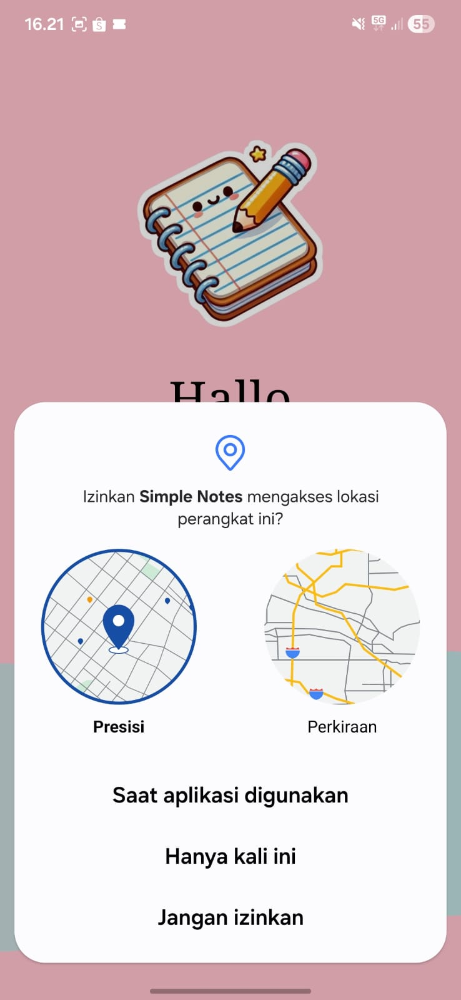
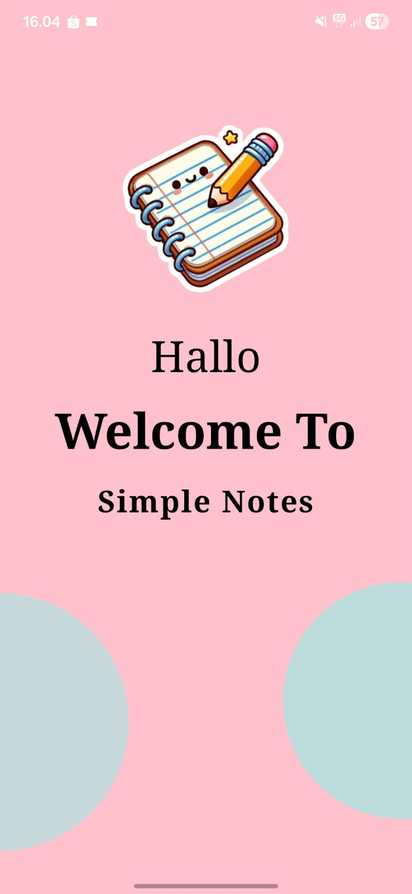
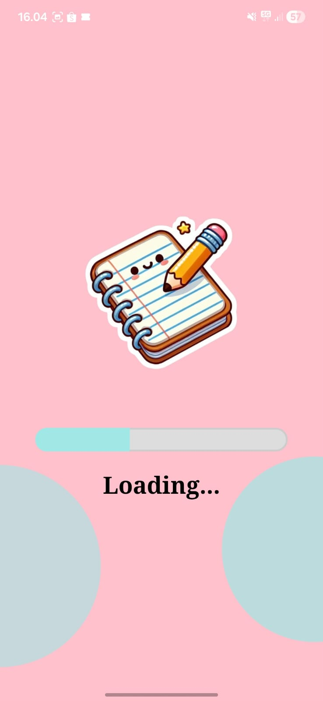
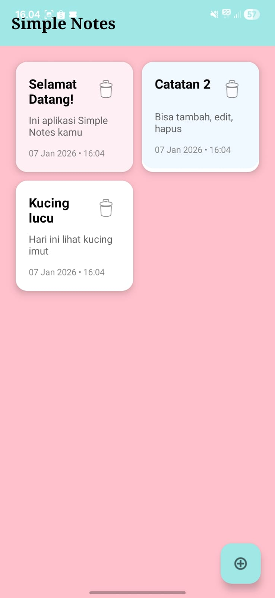

# Simple Notes

Aplikasi catatan sederhana dengan desain **kawaii aesthetic** bertema **pink pastel** yang super lembut dan menyenangkan. Cocok untuk mencatat ide, reminder harian, atau curhatan random dengan tampilan yang bikin senyum 😊

<p align="center">
  
  
  
  
</p>

## Fitur Utama

- **Splash Screen**  
  Tampilan pembuka berwarna pink pastel dengan gambar buku catatan lucu + pensil + teks "Hallo Welcome To Simple Notes" yang menggemaskan

- **Loading Screen**  
  Animasi loading lurus (oval) dengan karakter buku catatan kawaii yang sedang menulis + teks "Loading..." — durasi singkat tapi bikin gemes

- **Halaman Utama**  
  - Toolbar teal pastel dengan judul "Simple Notes" (hitam bold)
  - Kartu catatan berlatar pink pastel dengan judul & isi catatan
  - Timestamp di setiap catatan (contoh: 07 Jan 2026 • 16:04)
  - Tombol hapus (ikon tong sampah) di setiap kartu
  - Floating Action Button (FAB) berbentuk lingkaran biru pastel dengan ikon +

- **Tema Keseluruhan**  
  Pink pastel lembut (#FFFFC1CC) sebagai background utama, aksen biru pastel (#A0E7E5) untuk toolbar & FAB, desain minimalis tapi penuh kehangatan

## Preview Aplikasi

| Lokasi          | Splash Screen         | Loading Screen          | Halaman Utama      |
|---------------------------------|---------------------------------|---------------------------------|---------------------------------|
|  |  |  |  |

## Cara Instal & Jalankan

1. Clone repository
   ```bash
   git clone https://github.com/[username-kamu]/simple-notes.git
   cd simple-notes
